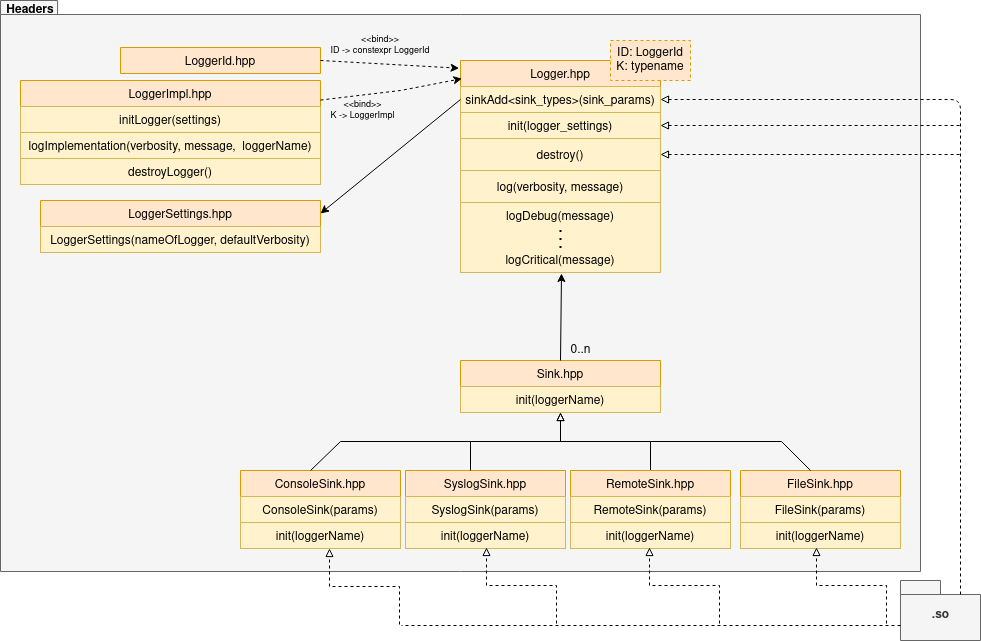

# How it works

This library provides logging API in form of .hpp files and .so library bin with specific implementation.

## API

Api is divided into Logger and sinks. Sinks provide logging to specific output like console or file and takes
sink-specific parameters. Logger takes global parameters and handles logging into sinks.

## Usage

First of all, sinks have to be added to logger. This will be accomplished calling function Logger::addSink<>() with type
of sink and its parameters (see parameters section). There can be more sinks of same type with different settings, for
example to file loggers, one for error logging and one for debug logging. After all sinks have been added call Logger::init.
After initialization thread safe logging can be performed from anywhere. Logging functions:
- Logger::log(verbosity, message)
- Logger::logVERBOSITY(message)
Fmt message format is supported

### Verbosity levels
    Debug = 0    -  debugging messages (i.e. memory dump)
    Info         -  actual state of program (i.e. module initialized)
    Warning      -  condition that might cause a problem in the future but program can ignore it (i.e. missing parameter and using default one)
    Error        -  error occurs but program is able to continue (i.e. failed thread)
    Critical = 4 -  program is unable to continue (i.e. segmentation fault)
Sink verbosity is primary used than logger verbosity.
Example:
If verbosity level is set to Warning level, it will not show Debug and Info.

## Parameters
List of parameters of sinks and logger

### Logger
- programName_ - name of the program, will be used by logger as logger name
- filter - optional structure for setting message filtering
- logFormat - optional format of logging message
- verbosity - if sink does not have verbosity set, this verbosity will be used by sink if verbosity was not provided for sink

### ConsoleSink
- verbosity - optional verbosity of sink (Logger::verbosity)

### FileSink
- verbosity - optional verbosity of sink (Logger::verbosity)
- fileDir - directory path where logs will be stored
- filename - name of log file with extension
- maxFileSize - maximum size of file in bytes, after reaching this size file will be rotated
- numberOfRotatedFiles - number of files that will be created and rotated, so it will create 1 + numberOfRotatedFiles files

### RemoteSink
- verbosity - optional verbosity of sink (Logger::verbosity)
- ipv4 - IPv4 of remote server where logs will be sended
- port - port of server app
- 
### SyslogSink
- identity - prepended to message usually program name
- options - flags controlling operations
- facility - what type of program is logging messages
- enable formatting - enables formatting

## Implementations
- dummy - for api testing purposes
- spdlog - thread safe logger

# Architecture

